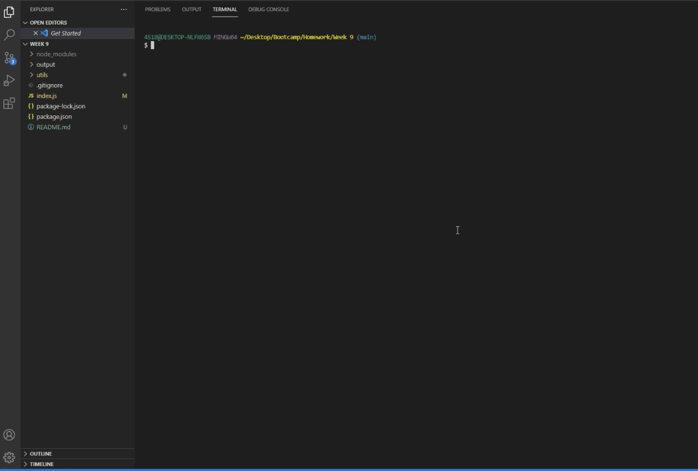

# Week 9 - University of Adelaide Coding Boot Camp

## Node.js - Professional README Generator

 

## Tasks includes

- [x] To create a command-line app that dynamically generates a professional README.md from a user's input

- [x] To display user's project title as the title of the README

- [x] To add user's project description, installation instructions, usage information, contribution guidelines and test instructions.

- [x] To ask user to choose from a list of licences and create a badge of the licence for the README

- [x] To have a questions section with instructions on how to reach the user

- [x] To have working links in the Table of Contents

## Demo of the app

 

## [Watch the demo here (YouTube)](https://youtu.be/FMLxOXHCV3I)

---

© Carl Santiago\
📧 4518gg@gmail.com
